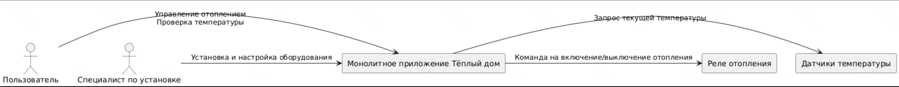
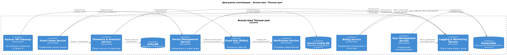
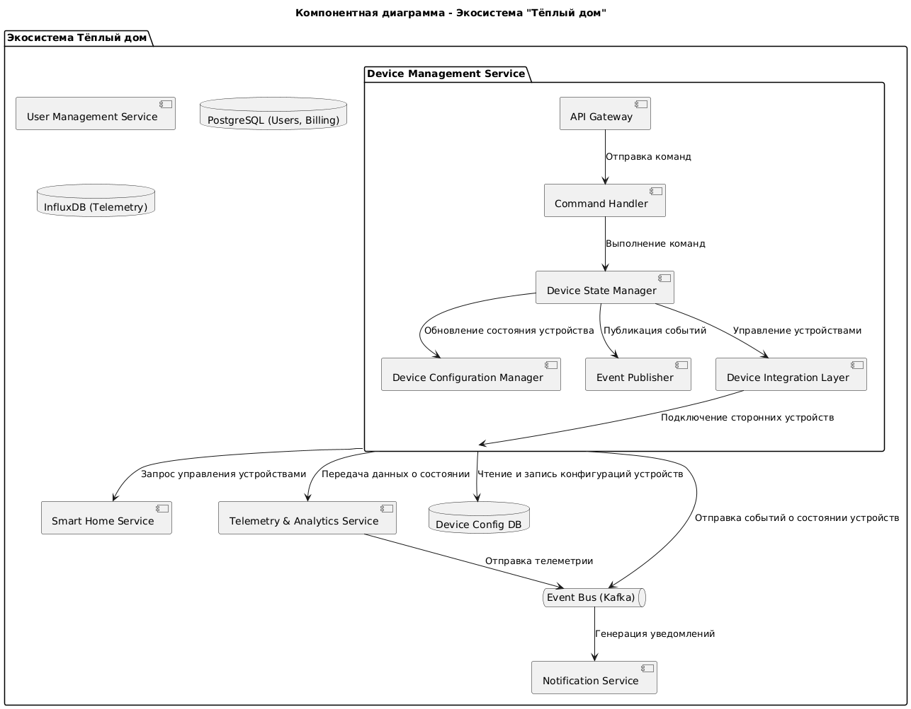
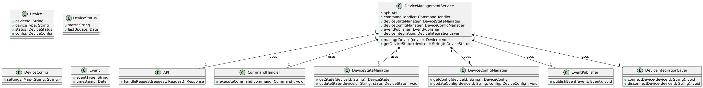
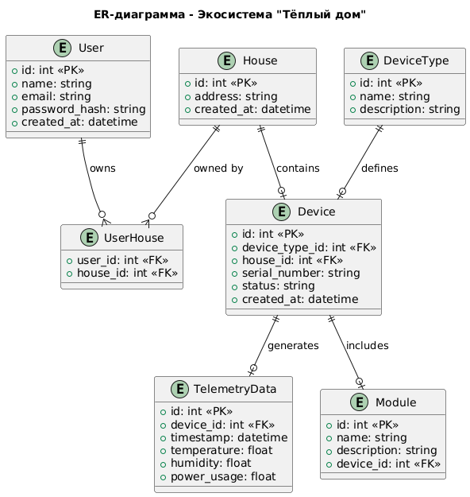

Это шаблон для решения **первой части** проектной работы. Структура этого файла повторяет структуру заданий. Заполняйте его по мере работы над решением.

# Задание 1. Анализ и планирование

Чтобы составить документ с описанием текущей архитектуры приложения, можно часть информации взять из описания компании условия задания. Это нормально.

### 1. Описание функциональности монолитного приложения

**Управление отоплением:**

- Пользователи могут управлять системой отопления в помещении: включить/выключить систему отопления, установить целевую температуру

**Мониторинг температуры:**

- Пользователи могут просматривать текущую температуру в своих домах через веб-интерфейс
- Система получает данные о температуре с датчиков, установленных в домах

### 2. Анализ архитектуры монолитного приложения

Приложение написано на языке Java 17, использует базу данных PostgreSQL, а также веб-фреймворк Spring Boot. Взаимодействие с базой реализовано через ORM Hibernate. 
Используется один общий контроллер для всей функциональности. Взаимодействие с клиентским приложением реализовано через REST API (синхронно). 
Масштабированность ограничена, т.к. монолит и его сложно масштабировать по частям. Развертывание приложения требуется остановки всего приложения и перезапуск, т.к. сейчас развернуто в одном экземпляре. 

### 3. Определение доменов и границы контекстов

- Домен Управление устройствами: управлением отоплением
- Домен Домашняя автоматизация: управление отоплением
- Домен Мониторинг и аналитика: сбор данных с датчиков

### **4. Проблемы монолитного решения**

- Ограниченная масштабируемость: вся логика системы работает в одном сервисе, поэтому увеличение нагрузки требует масштабирования всего приложения целиком. Это неэффективно и дорого.
- Низкая гибкость при добавлении нового функционала: любое изменение требует обновления всего монолита, что увеличивает сложность и риски внедрения новых функций (например, управление освещением или камерами видеонаблюдения).
- Отсутствие поддержки асинхронных взаимодействий: вся система работает в синхронном режиме (запрос-ответ). Это увеличивает задержки при управлении устройствами и сборе данных.
- Проблемы с подключением новых устройств: пользователь не может сам подключить датчик, это требует выезда специалиста.
- Ограниченная отказоустойчивость: полный отказ приложения из-за сбоя в одной из частей системы (например, база данных).
- Сложность интеграции с внешними сервисами: интеграция с новыми устройствами (разных производителей) требует сложных доработок в монолите.

### 5. Визуализация контекста системы — диаграмма С4

context_diagram.puml

# Задание 2. Проектирование микросервисной архитектуры

В этом задании вам нужно предоставить только диаграммы в модели C4. Мы не просим вас отдельно описывать получившиеся микросервисы и то, как вы определили взаимодействия между компонентами To-Be системы. Если вы правильно подготовите диаграммы C4, они и так это покажут.

**Диаграмма контейнеров (Containers)**

containers_diagram.puml

**Диаграмма компонентов (Components)**

component_diagram.puml

**Диаграмма кода (Code)**

code_diagram.puml

# Задание 3. Разработка ER-диаграммы

er-diagram.puml

